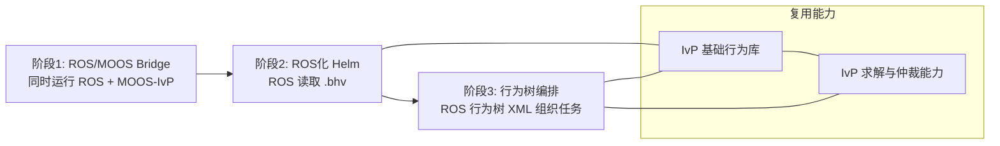

# ROS × MOOS-IvP 任务导向操作套件集成工程

## 项目概述
本项目旨在将任务导向操作套件（Mission-Oriented Operating Suite，MOOS-IvP）中的仲裁框架与原生水下航行器行为模块集成进机器人操作系统（ROS），以构建可执行任务规划与控制的水下机器人系统。MOOS 本身是一种发布-订阅系统，用于协助网络中任意数据的通信传输。为完成目标任务，机器人系统除需具备避障、对齐任务规范等反应性功能外，还需配备决策组件。IvP-Helm 作为自主决策引擎，运行于机器人平台后台，接受行为文件（`*.bhv`）并通过区间编程融合各类行为，输出统一的航向-速度-深度指令。其脚本语言（`*.bhv`）支持多行为并行执行与逻辑仲裁。该仓库基于多目标决策理论（MODT）开发的 MOOS 区间编程（IvP）舵控系统（IvP-Helm）进行 ROS 化集成，并逐步演进至以行为树组织任务。 

## 项目结构
源码位于 `src/`，包含多个 ROS 功能包（基于目录名的梳理）：

- `ros_moos_bridge`：ROS/MOOS 通信桥接相关功能包。
- `ros_helm`：将 pHelmIvP 功能抽离后的 ROS 化 Helm 包。
- `ros_behavior_tree`：以行为树组织任务的 Helm 替代实现。
- `controller_manager`：控制器管理框架。
- `auh_controller_pid`：PID 控制器包。
- `auh_thrust_manager`：推进器推力分配功能。
- `uuv_simulator`：第三方水下环境仿真插件包。
- `variable_extractor`：话题提取与统一输出工具。
- `docking_nav`：面向 docking 任务的实验功能包（方案 2 与方案 3 使用）。
- `docking_optical_vision` / `docking_optical_msgs`：docking 任务的视觉感知相关功能包。
- 其他基础包：`auh_control`、`auh_description`、`auh_launch`、`common_msgs`、`common_tools`、`sds_description`。

## 三阶段演进方案
项目采用渐进式演进策略，将 MOOS-IvP 的仲裁能力逐步移植到 ROS 中：

1. **ROS/MOOS Bridge 阶段**
   - 目标：开发可链接 MOOS 通信库的 ROS 节点，实现 ROS/MOOS 双向通信。
   - 运行方式：需同时启动 ROS 与 MOOS-IvP。

2. **ROS 化 Helm 阶段**
   - 目标：将 MOOS-IvP 的 `pHelmIvP` 节点抽离为 ROS 功能包，仅依赖 ROS 即可运行。
   - 运行方式：通过 `*.bhv` 行为文件读取任务（对应 `ros_helm`）。

3. **行为树编排阶段**
   - 目标：引入 ROS 行为树（`ros_behavior_tree`），用行为树替代 Helm 的任务编排，但仍复用 IvP 的基础行为与求解能力。
   - 运行方式：不再通过 `*.bhv`，而是使用行为树 `*.xml` 文件组织任务。

## 相关子系统与功能包
- **控制与执行**
  - `controller_manager` 负责控制器管理，目前使用 PID 控制器（`auh_controller_pid`）。
  - `auh_thrust_manager` 用于推进器推力分配。
- **仿真与验证**
  - `uuv_simulator` 为 ROS 第三方插件包，用于模拟水下环境。
- **任务与实验包**
  - `docking_nav` 为方案 2 与方案 3 的实验包，可完成一次 docking 任务。
  - `docking_optical_vision` 提供 docking 任务视觉能力。
- **数据工具**
  - `variable_extractor` 为话题提取器，用于统一输出。

## 三阶段演进图（Mermaid）

## 目标总结
通过以上演进路径，项目在 ROS 生态内逐步实现 MOOS-IvP 的任务仲裁与行为决策能力：
- 早期实现 ROS 与 MOOS-IvP 的互通；
- 中期将 Helm 独立成 ROS 功能包，减少对 MOOS 的运行依赖；
- 后期以行为树替代 Helm 任务编排，同时保留 IvP 行为求解能力，提升任务组织的可扩展性与可维护性。
